# Breakfast

*Works with [Autodarts](https://autodarts.io).*

Breakfast is a self-hosted companion for your Autodarts board. It shows a live scoreboard on any screen in
the room, announces the game with a built-in voice caller, adds game modes and practice drills beyond X01,
keeps lifetime statistics and can drive LED displays over MQTT. It connects to the Autodarts cloud with your
own account and needs no other add-on.

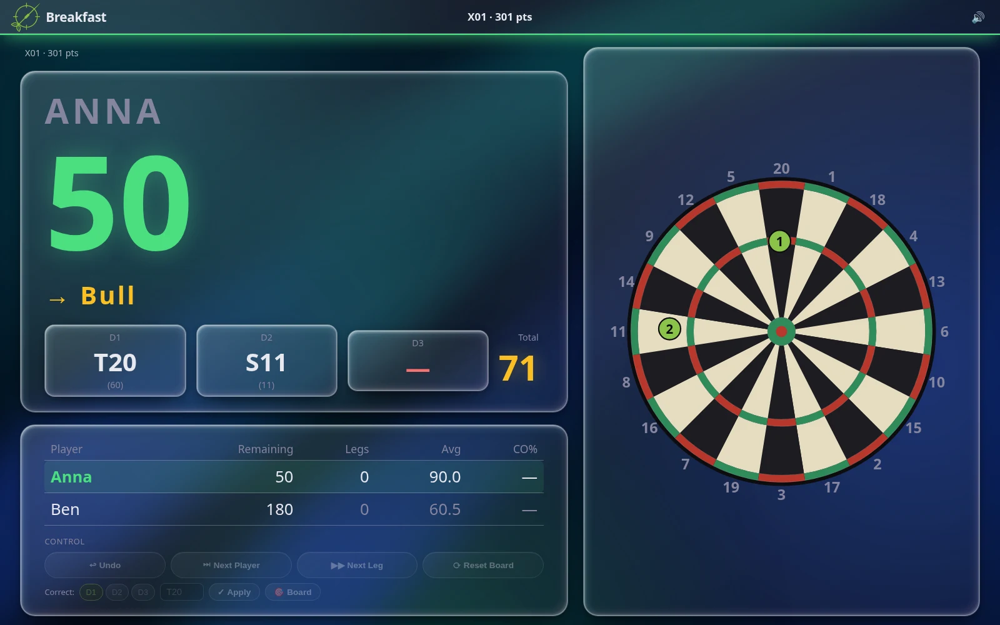

## Features

- [Live scoreboard and TV view](#tv-view): full screen on a TV or tablet, with checkout suggestions and a live dartboard
- [Games and drills](#games-and-drills): X01, Elimination, Target Battle, Killer, Field Training, Black Belt and a Checkout Trainer
- [Voice caller](#voice-caller-and-voice-packs): announces the game, with English and German voice packs and an editor for your own
- [Statistics](#statistics): averages, records, heatmaps and leaderboards
- [Achievements](#achievements): badges for milestones such as a 180 or a nine-dart leg
- [Online Elimination](#online-elimination): play one Elimination match together with players at other locations
- [MQTT output](#mqtt) for LED strips and Home Assistant, optional
- [Installation](#installation) on Windows, with Docker or from source, with [self-update](#updates)
- [Settings](#web-ui) in the browser, English or German interface

## How it works

```
Autodarts cloud ── Breakfast ── local board connection (dart positions)
                      │
          ┌───────────┼───────────────┐
       Web UI        MQTT          Voice caller
   (phone, tablet,  (LED strips,   (announcements play in a
     TV, PC)         Home Assistant) browser on /audio, on the
                                     device with the speakers)
```

## Installation

### Windows

Download `breakfast-windows-vX.Y.Z.zip` from the latest release. It contains a single folder with
`breakfast.exe`; Python and Docker are not needed.

1. Unzip it, for example to `C:\Breakfast`, and start `breakfast.exe`. Your browser opens the Settings page:
   enter your Autodarts account under **Autodarts Source**, save, and press **Restart**.
2. Windows asks once whether Breakfast may use the network. Allow it for private networks so that a TV or
   phone can reach `http://<pc>:8080`.
3. Optional: run `install-autostart.ps1` with PowerShell to start Breakfast when you log in
   (`remove-autostart.ps1` undoes it).

Everything Breakfast stores lives in the `data` folder next to `breakfast.exe`; back it up to keep your
statistics. The program is not signed: if Windows says "Windows protected your PC", choose **More info**,
then **Run anyway**.

### Docker

```bash
git clone https://github.com/3lefeint/breakfast26.git
cd breakfast26
mkdir -p data/sessions data/sounds
cp config.toml.example data/config.toml   # fill in your values
docker compose up -d
```

Autodarts itself keeps running natively on the host; only Breakfast is containerized. The header of
`docker-compose.yml` explains the one setting Breakfast needs to reach the board from inside the container
(`board_ws_url`).

### From source

Needs Python 3.11+ and Node.js 22+.

```bash
git clone https://github.com/3lefeint/breakfast26.git
cd breakfast26
python -m venv .venv
source .venv/bin/activate          # Windows: .venv\Scripts\activate
pip install -r requirements.txt
(cd frontend && npm ci && npm run build)
cp config.toml.example config.toml   # fill in your values
python main.py
```

To run it as a service on Linux, copy `systemd/breakfast.service` to `/etc/systemd/system/`, replace
`YOUR_USER` and the paths in it, and run `sudo systemctl enable --now breakfast`.

Then open `http://<host>:8080`.

## Configuration

Breakfast reads `config.toml` (from the project folder, or from `data/` for Docker and Windows). Every option
is documented in `config.toml.example` and can be changed in the browser under **Settings**. The minimum
is your Autodarts account:

```toml
mode = "direct"

[direct]
email    = "user@example.com"
password = "your-password"
board_id = "xxxxxxxx-xxxx-xxxx-xxxx-xxxxxxxxxxxx"

[web]
port = 8080
```

The other sections (`[audio]`, `[mqtt]`, `[stats]`, `[online]`, `[logging]` and more) are described in
`config.toml.example`. MQTT and statistics can be switched off (`[mqtt] enabled = false`, `[stats] db = "none"`).

## Using Breakfast

### Web UI

Open `http://<host>:8080` from any device on your network. **Play** sets up and starts the games and drills,
**Players** lists the players with their profiles and achievements, **Stats** shows the statistics, and
**Settings** edits everything in `config.toml` without touching the file. Settings also holds the voice-pack
editor, the update check and the look of the interface: language, theme, accent color and an animated
background. `/tv` and `/audio` are separate pages, described below.

<table>
<tr>
<td width="50%">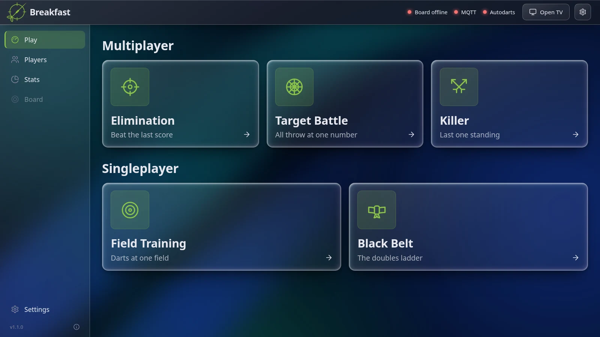</td>
<td width="50%">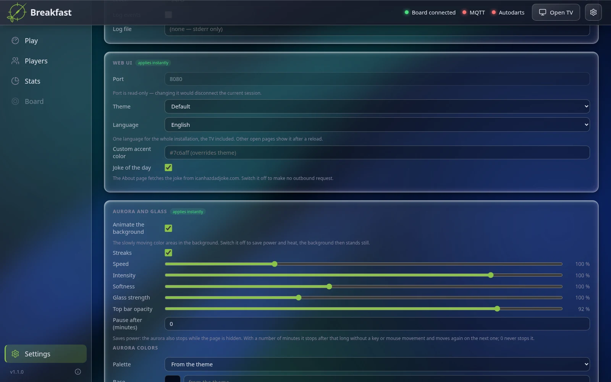</td>
</tr>
</table>

### TV view

Open `http://<host>:8080/tv` on a display near the board. It shows whichever game is running. For X01 that
is the scoreboard with the remaining score, the suggested checkout (with a "Bogey" badge for scores that
cannot be checked out) and the live average, 180s and checkout rate next to each player. With the local
board connection, a dartboard shows where each dart of the current turn landed.

The X01 view also controls the board: undo the last detected throw, skip to the next player or leg, and
reset the board. To correct a misread dart, tap it and choose the right field, or click the spot on a
dartboard.

### Games and drills

- **X01**: played on the board as usual; Breakfast adds the scoreboard, checkout suggestions and voice calls.
- **Elimination**: any number of players, each with a number of lives. Every turn has to beat the total of
  the previous turn, otherwise the player loses a life; the last player with lives left wins. Turns can be
  corrected and undone.
- **Target Battle**: in each round, all players throw at the same target number, and only a dart on that
  number scores. A wheel picks a random target every round, or you set the order yourself. Single, double and
  triple score 1, 2 and 3 points, or you practice with only one of them counting.
- **Killer**: every player gets a number. Hitting the double of your own number makes you a killer, and a
  killer takes a life from an opponent by hitting the double of that opponent's number. The last player left
  wins.
- **Field Training**: one player throws a fixed number of darts at a single field, a number or the bull. The
  result shows the points, the hit rate and a rating.
- **Black Belt**: a doubles drill for one player. Hit D1 to D20 and finally the bull's eye, in order (or from
  D20 down to D1). If a field is not hit with its darts, you start again from the beginning. You earn the
  belt by getting through the whole ladder in one go.
- **Checkout Trainer**: three exercises for finishing. *Random checkout* draws a score you can finish with
  three darts, and you throw it on the board (the standard route can be shown while you throw). The Stats page
  shows which scores work and which do not. *Route quiz* and *Setup shots* are played on a virtual board
  without darts, also on a phone: tap the first dart of a route, or tap the darts that set up a finish and see
  what is left and what that rest allows.

<table>
<tr>
<td width="33%">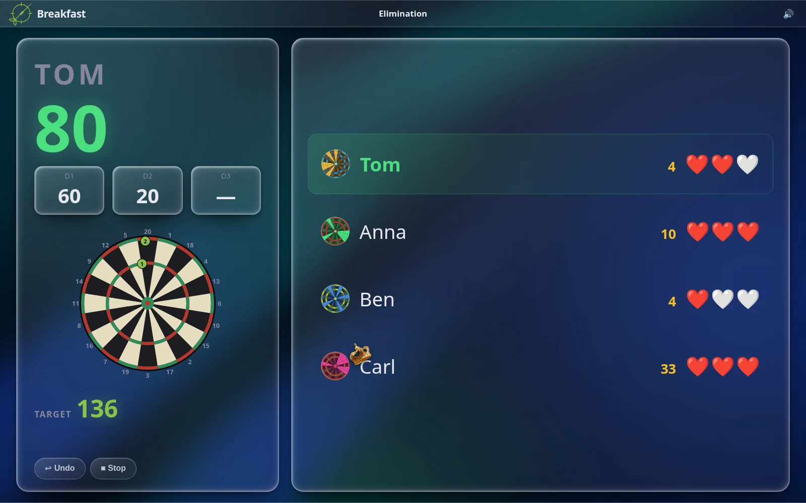<br><sub>Elimination</sub></td>
<td width="33%">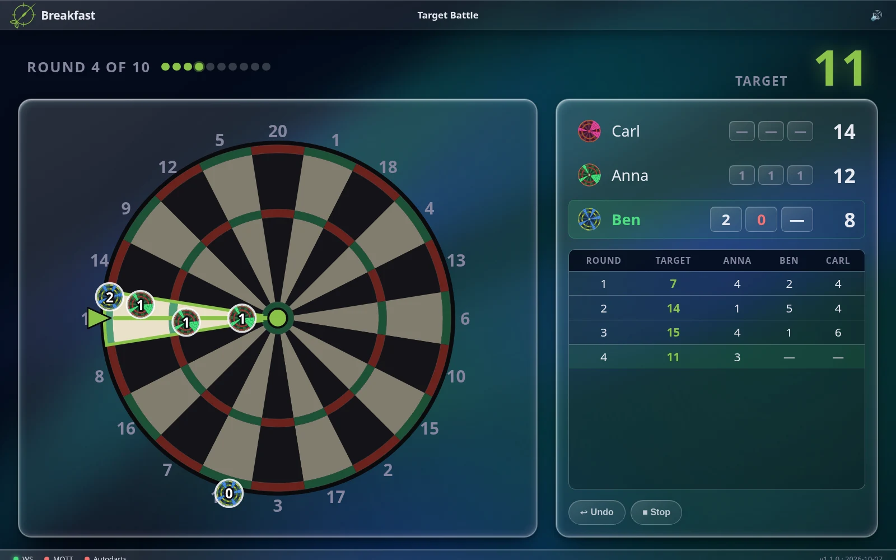<br><sub>Target Battle</sub></td>
<td width="33%">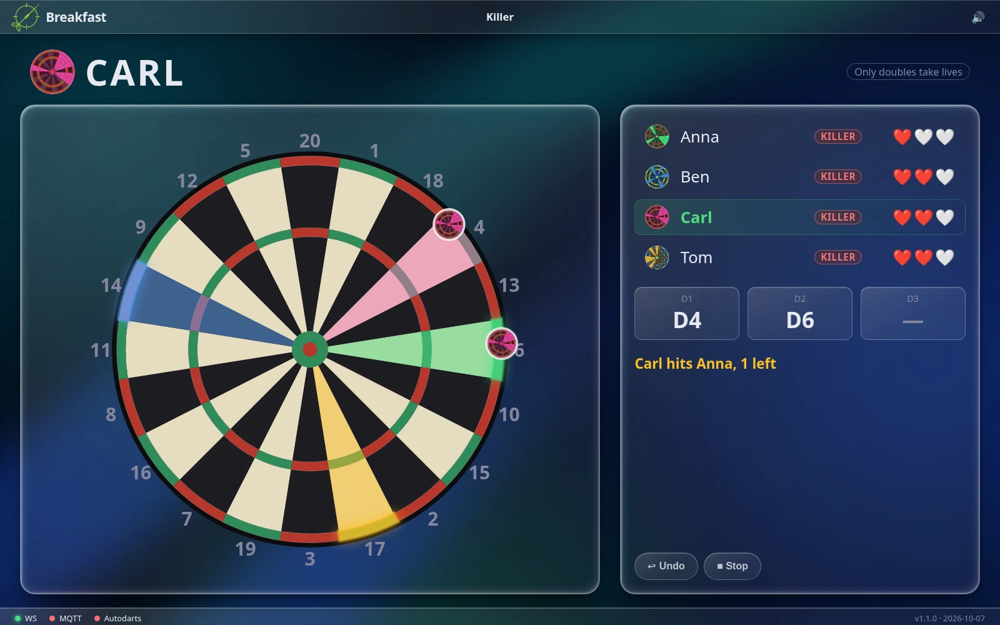<br><sub>Killer</sub></td>
</tr>
<tr>
<td width="33%">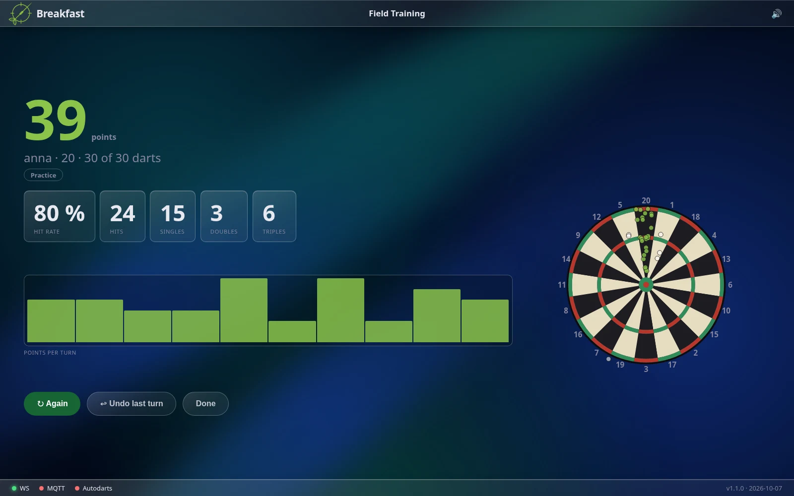<br><sub>Field Training</sub></td>
<td width="33%">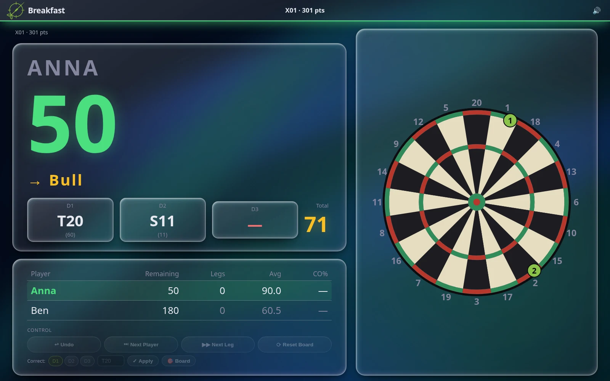<br><sub>Black Belt</sub></td>
<td width="33%"></td>
</tr>
</table>

### Voice caller and voice packs

With `[audio] dir` set, Breakfast announces X01 matches itself: the start and end of legs and matches, every
dart, turn totals, checkouts ("you require ...") and busts. The sound plays in a browser tab on `/audio`.
Open it on the device that is connected to the speakers, click **Enable sound** once and leave the tab
open.

A voice pack is a folder of plain `key.mp3` files. Two ready-made packs, English (`tools/voicepack_ryan.toml`)
and German (`tools/voicepack_leni.toml`), can be generated from text with `edge-tts` and `ffmpeg`:

```bash
pip install edge-tts
python tools/generate_voicepack.py tools/voicepack_ryan.toml --out <audio dir>/profiles/ryan
# then set [audio] profile = "ryan"; your own files stay as fallback
```

To change a single entry, use **Settings → Voice Pack**: pick a group, enter a key and one or more variants,
listen to a preview and save. [VOICE_PACKS.md](VOICE_PACKS.md) lists every call key, explains where the
names of your players are kept, and shows how to record a pack of your own.

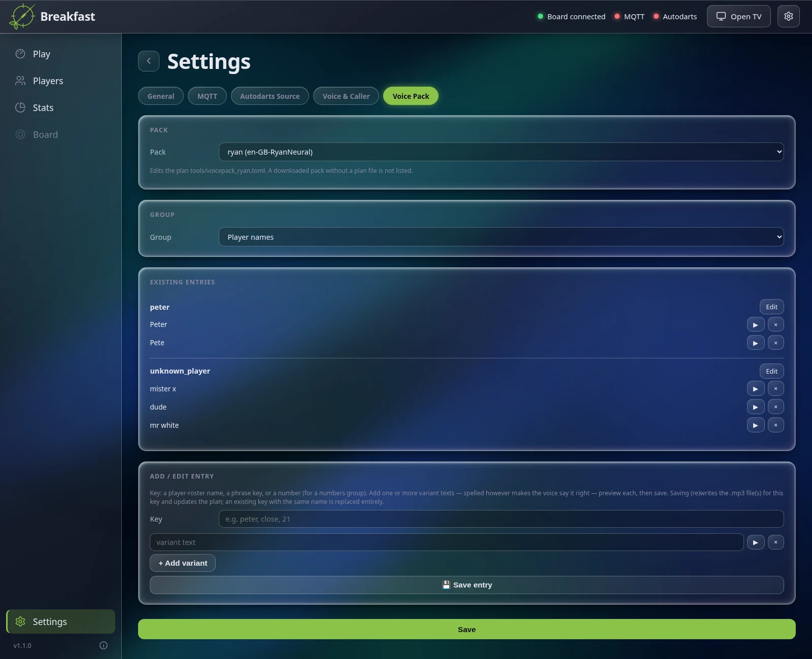

### Statistics

Every turn is stored locally in `stats.db`. The **Stats** page has a view for each game mode with records,
comparisons between players and recent matches; for X01 also per-player details such as a score histogram
and a heatmap of the board. Leaderboards rank players by average, 180s and checkout rate.

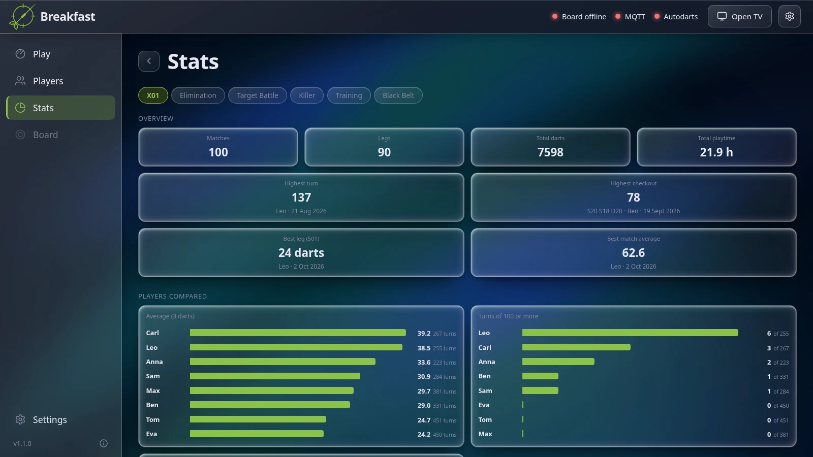

### Achievements

Players earn achievements in their matches: a bullseye, a 180, a big checkout, streaks, a nine-dart leg and
many more, some with several tiers and some secret. They appear as badges in the player profile. Only
matches played after achievements were first enabled on your installation count. Most are announced as soon
as they happen and made final when the match ends, so a game with many players does not end with a long run
of banners.

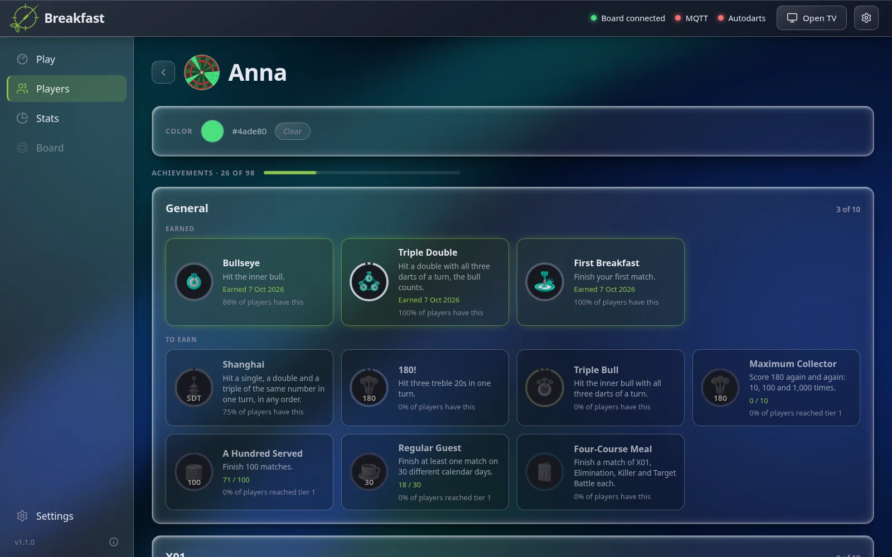

When a match ends, the TV announces what was earned:

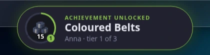

### Online Elimination

Play one Elimination match together with players at other locations, each on their own Breakfast
installation. One site hosts the match and receives a join code; the others join with that code and a shared
password. Each site adds its own players, and the host sets the lives and the order.
Online play needs a relay (a small Cloudflare Worker, see [relay/README.md](relay/README.md)) and
`[online] relay_url`; without it, online play is off.

### MQTT

Breakfast can publish its state to an MQTT broker, for example to drive ESPHome LED strips or to feed Home
Assistant (configured in `[mqtt]`; ESPHome examples are in `ESPHome/`). MQTT is optional, everything else
works without it. All topics are published under a base topic (default `autodarts`):

| Topic | Value |
|-------|-------|
| `autodarts/current/...`, `autodarts/match/...`, `autodarts/players/<index>/...`, `autodarts/board/status` | the active player and their darts, the match, the remaining score of each player and the board status |
| `autodarts/<game>/active`, `.../state` | for `elimination`, `target_battle`, `killer`, `field_training`, `black_belt` and `checkout_training`: whether the game is running, and its full state as retained JSON |
| `autodarts/<game>/current/...`, `.../last_turn/...`, `.../events/...` | the turn in progress, the last finished turn and one-time events of the game |
| `autodarts/<game>/command` | Breakfast listens here: JSON `{"action": ...}` to start, stop, undo or correct a game |

## Updates

- **Windows**: Settings → **Updates** checks for a newer GitHub release, downloads it, verifies its SHA-256
  checksum and installs it. The old version is kept until the new one passes its health check, and is
  restored if it does not.
- **Docker**: the `updater` service in `docker-compose.yml` provides the same function under Settings →
  **Updates**: it pulls the newest release tag, rebuilds, restarts and rolls back if the new build is not
  healthy. Remove the service if you do not want self-update.

## Security

Breakfast has no login. Anyone who can reach its web port can watch games, start and stop them, change the
settings and restart the app. Run it only on a trusted home or club network and do not expose port 8080 to
the internet. If you need remote access, put your own authentication in front of it (a VPN or a reverse
proxy with a login). The Autodarts and MQTT credentials are stored in plain text in `config.toml`, so keep
that file private. To report a vulnerability, see [SECURITY.md](SECURITY.md).

## Acknowledgements

- The calling behavior, the call keys and the voice-pack format are modeled on the darts-caller project, so
  its voice packs work unchanged.
- Breakfast is an independent project and not affiliated with or endorsed by Autodarts. It talks to the
  Autodarts cloud with your own account; check Autodarts' terms of use for your setup.

## License

MIT, see [LICENSE](LICENSE).
